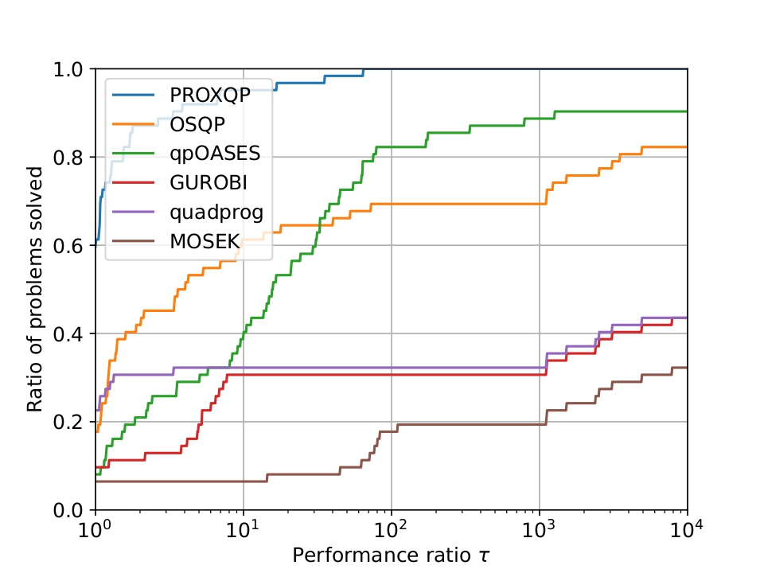

# Benchmark examples for the PROXQP solver

These are the scripts to compare the following Quadratic Program (QP) solvers

-   PROXQP (with dense backend)
-   OSQP
-   GUROBI
-   MOSEK
-   qpOASES
-   quadprog

The whole API comes from the one developped by the authors of [OSQP](https://github.com/osqp/osqp_benchmarks/). We thank them a lot for their rigorous approach.

The detailed description of these tests is available in [this paper](https://arxiv.org/pdf/1711.08013.pdf).

To run these scripts you need standard python libraries: `pandas`, `matplotlib`, `numpy`, `scipy`, `scikit-learn`, and `cvxpy`, which can be installed using for example conda:
```bash
conda install pandas matplotlib numpy scipy cvxpy scikit-learn
``` 
You need further as well to install the solvers `gurobi`, `mosek`, `OSQP`, `quadprog` and `qpOASES`. The first four can be installed for example using conda:
```bash
conda install -c gurobi gurobi
conda install -c mosek mosek
conda install -c conda-forge osqp
conda install -c omnia quadprog
```
Gurobi and Mosek require a license for working. Note that if you are an academic, they provide specific and temporary free licenses.

Finally, for installing qpOASES, you should look at their [install file](https://github.com/coin-or/qpOASES/blob/master/INSTALL.txt) in their github repository.

All the scripts come with options (default to `False`)

- `--parallel` for parallel execution across instances
- `--verbose` for verbose solvers output (they can be slower than necessary while printing)
- `--high_accuracy` for high accuracy `eps=1e-09` solver settings + optimality checks

Note that the parallel option has not be tested for the paper benchmarks.

## Benchmark problems
The problems are all randomly generated as described in the [ProxQP paper](https://arxiv.org/pdf/1711.08013.pdf).
Problem instances include

-   Inequality and Equality Constrained QP,
-   Pure Inequality Degenerate QP,
-   Pure Inequality QP without strictly convex Hessian matrix.

We generate the problems using the scripts in the `problem_classes` folder.

To execute these tests run
```python
python run_benchmark_problems.py
```

### Results

For Convex Quadratic Programs with inequality and equality constraints, when asking for a high accuracy (e.g., 1.E-9), the resulting [shifted geometric means](http://plato.asu.edu/ftp/shgeom.html) are, for `dense` problems 

| PROXQP | quadprog          | OSQP            | GUROBI             | MOSEK              | qpOASES            |
| -----  | ----------------- | --------------- | ------------------ | ------------------ | ------------------ |
| 1.0    | 20.4              | 18.2            | 5177.8             | 38131.0            | 282.6              |

<p align="center">
  
</p>

and for `sparser` one (i.e., a ratio of sparsity of around 15%)

| PROXQP | quadprog          | OSQP            | GUROBI             | MOSEK              | qpOASES            |
| -----  | ----------------- | --------------- | ------------------ | ------------------ | ------------------ |
| 1.0    | 19.3              | 3.5             | 6938.0             | 76844.2            | 260.6              |


These results have been executed with a 11th Gen Intel(R) Core(TM) i7-11850H @ 2.50GHz CPU.

## Maros Meszaros problems
These are the hard problems from the [Maros Meszaros testset](http://www.cuter.rl.ac.uk/Problems/marmes.shtml) converted using [CUTEst](https://ccpforge.cse.rl.ac.uk/gf/project/cutest/wiki) and the scripts in the [maros_meszaros_data/](./problem_classes/maros_meszaros_data) folder.

To execute these tests run
```python
python run_maros_meszaros_problems.py
```

### Results
The resulting [shifted geometric means](http://plato.asu.edu/ftp/shgeom.html) are when asking for a high accuracy (e.g., 1.E-9)

| PROXQP | quadprog          | OSQP            | GUROBI             | MOSEK              | qpOASES            |
| -----  | ----------------- | --------------- | ------------------ | ------------------ | ------------------ |
| 1.0    | 105.8             | 14.2            | 114.2              | 194.9              | 4.5                |

<p align="center">
  
</p>

At lower accuracy (e.g., 1.E-3), the resulting shifted geometric means are

| PROXQP | quadprog          | OSQP            | GUROBI             | MOSEK              | qpOASES            |
| -----  | ----------------- | --------------- | ------------------ | ------------------ | ------------------ |
| 1.0    | 1543.3            | 108.5           | 637.3              | 175.3              | 17.1               |

These results have been executed as well with a 11th Gen Intel(R) Core(TM) i7-11850H @ 2.50GHz CPU.

## Citing

If you are using these benchmarks for your work, please cite the [ProxQP paper](https://arxiv.org/pdf/1711.08013.pdf):
```bash
@inproceedings{bambade:hal-03683733,
  TITLE = {{PROX-QP: Yet another Quadratic Programming Solver for Robotics and beyond}},
  AUTHOR = {Antoine Bambade, Sarah El-Kazdadi, Adrien Taylor, Justin Carpentier},
  URL = {https://hal.inria.fr/hal-03683733},
  BOOKTITLE = {{RSS 2022 - Robotics: Science and Systems}},
  ADDRESS = {New York, United States},
  YEAR = {2022},
  MONTH = June,
  PDF = {https://hal.inria.fr/hal-03683733/file/Yet_another_QP_solver_for_robotics_and_beyond.pdf},
  HAL_ID = {hal-03683733},
  HAL_VERSION = {v1},
}
```
